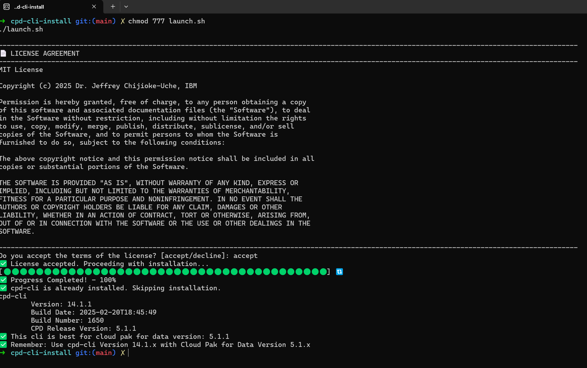

# Cloud Pak for Data CLI Installation 

The script allows you to install the cpd-cli so that you can complete administrative tasks on your Red Hat® OpenShift® Container Platform cluster.

### STEP 1: Clone the Toolkit
```sh
git clone https://github.com/schijioke-uche/cpd-cli-install-toolkit.git
```

### STEP 2: Change to the root directory
```sh
cd cpd-cli-install-toolkit
```

### STEP 3: Activate the Variable File by running this command
```sh
mv vars.sh.deactivated vars.sh
```

### STEP 4: Set your variables 
```sh
open vars.sh and set:
CPD_CLI_VERSION=""
OS_ARCHITECTURE=""
Save the file.
```

### STEP 5: Launch the installtion (It will prompt you to accept the license)
```sh
chmod 777 launch.sh
./launch.sh
```

### Samples

#### Sample 1


#### Sample 2



